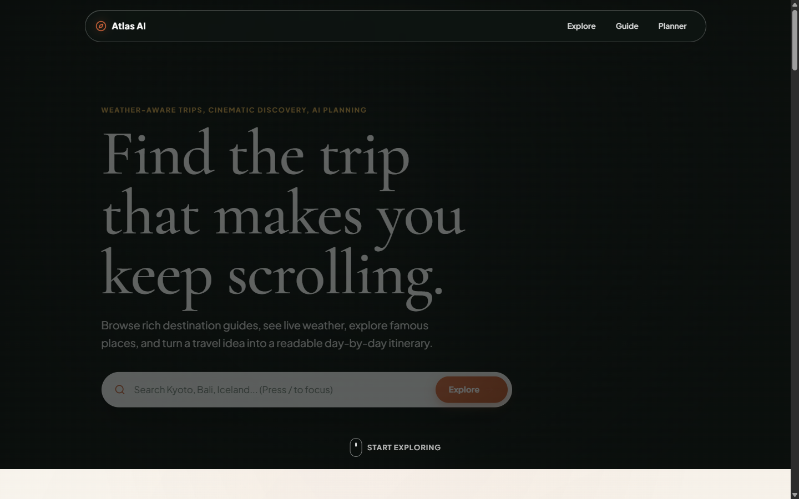
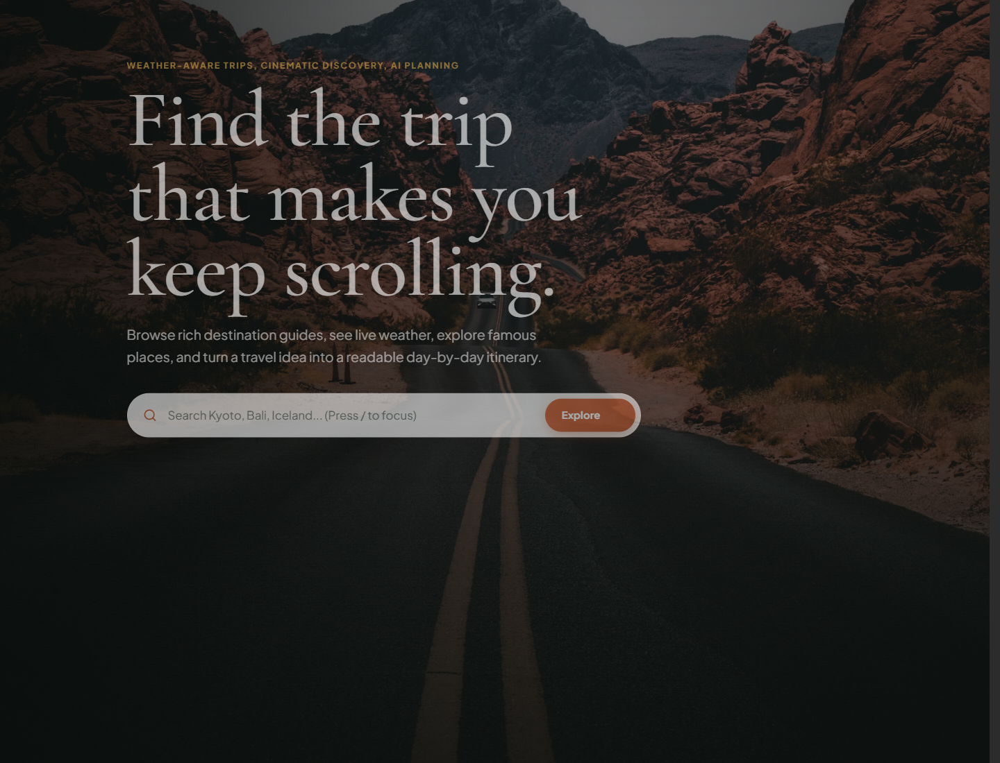
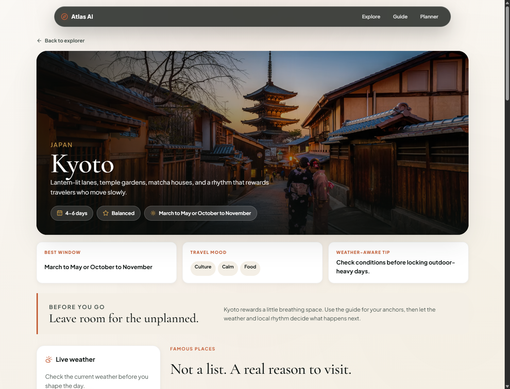
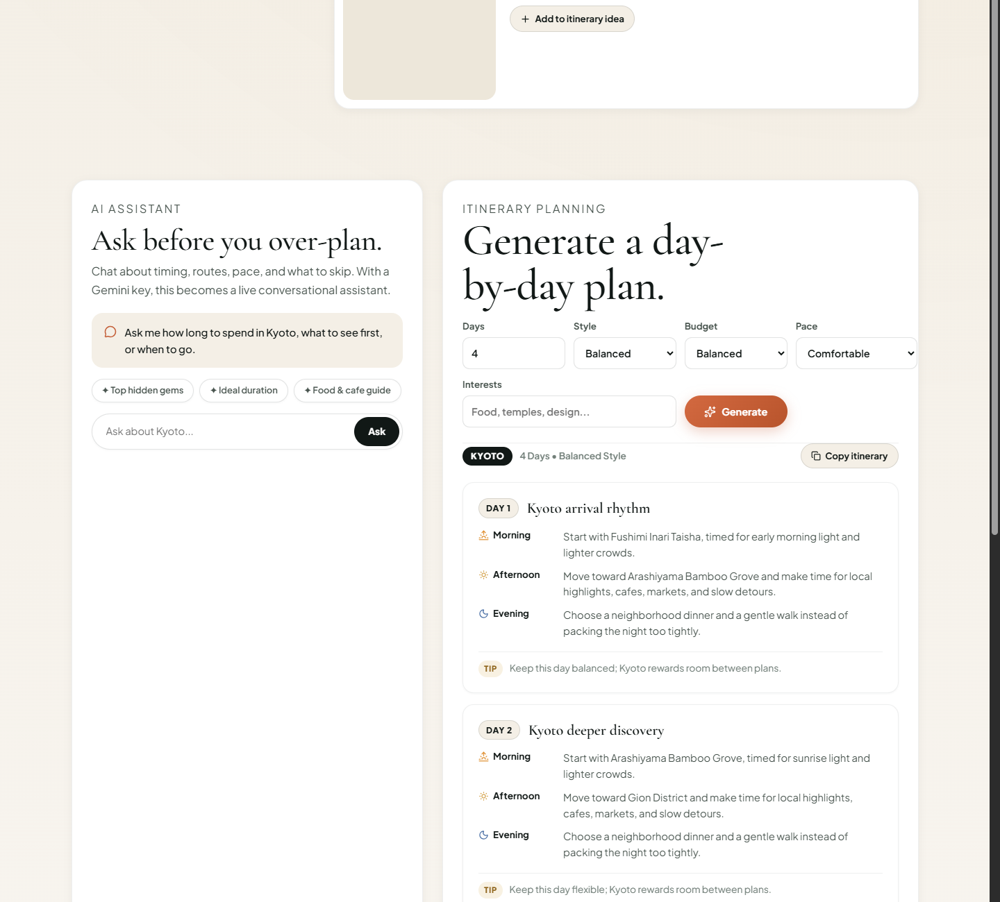

# Atlas AI — Editorial Travel Discovery & AI Planner

> *Travel planning that feels alive.*

Atlas AI is a cinematic, editorial travel discovery web application built for the **Designesthetics** Front-End Developer Assessment. It blends visual storytelling, real-time atmospheric intelligence, and generative AI to help travelers discover destinations, check live weather, explore curated landmarks, and turn travel ideas into structured day-by-day itineraries.

---

## Visual Showcase

### 1. Cinematic Hero & Keyboard-Driven Discovery

*Looping travel landscape video, search bar with `/` keyboard shortcut, and ambient discovery cues.*

---

### 2. Destination Explorer & Mood Filters

*Multi-dimensional filtering by mood (`Beach`, `Culture`, `Adventure`, `Food`, `Calm`, `City`), dynamic sorting, and photography cards.*

---

### 3. Destination Guide & Atmospheric Weather

*In-depth travel guides featuring quick facts, seasonal insights, live weather conditions via OpenWeather, geolocation detection, and famous places.*

---

### 4. AI Travel Assistant & Structured Itinerary Planner

*Conversational assistant powered by Google Gemini, configurable planner controls (pace, style, budget), structured daily timeline cards, and 1-click clipboard export.*

---

## How to Navigate the Application

Atlas AI is designed with an intuitive, uninterrupted narrative flow:

```
[ Hero Landing ]  ──( Press '/' or Search )──>  [ Destination Explorer ]
                                                        │
                                                        ▼  ( Select a Card )
[ AI Planner & Timeline ]  <──( Quick-Add Spot )───  [ Destination Guide & Live Weather ]
```

### 1. Landing & Instant Search (`/`)
- **Cinematic Atmosphere**: Begins with an ambient looping video background paired with warm editorial typography.
- **Global Search Shortcut**: Press **`/`** anywhere on your keyboard at any time to instantly focus the destination search input.
- **Quick Jump**: Click the **"Explore"** button or scroll cue to glide smoothly to the Explorer section.

### 2. Destination Explorer (`#explore`)
- **Mood Filter Bar**: Switch between travel moods: `All`, `Beach`, `Culture`, `Adventure`, `Food`, `Calm`, and `City`.
- **Dynamic Sort**: Re-order cards by:
  - **Popular**: Curated editorial order.
  - **Warmest**: Sorted by proximity to equatorial latitude.
  - **Best for Weekend**: Sorted by shortest recommended trip length.
- **Live Search**: Instant keyword filtering across destination names, countries, regions, summaries, and activity categories.
- **Select a Destination**: Click any destination card to open its dedicated guide.

### 3. Destination Guide & Live Weather
- **Editorial Overview**: Displays duration, budget tier, best travel window, and travel mood badges.
- **Live Weather Engine**: Click **"Check [Destination]"** to fetch live temperature, condition, humidity, and wind speed.
- **Location Awareness**:
  - Click **"Use my location"** to detect your current location via browser GPS.
  - Or type any city name into the search box to view its atmospheric conditions.
- **Weather-Aware Tips**: Contextual advice adapting to current weather (e.g. rain prompts indoor museum suggestions; clear skies recommend viewpoint hikes).

### 4. Famous Landmark Guides & Planner Quick-Add
- **Curated Spot Cards**: Handpicked famous places per destination with best times to visit (e.g. *Sunrise*, *Early morning*, *Golden hour*) and high-fidelity photography.
- **Add to Itinerary Idea**: Click the **"+ Add to itinerary idea"** button on any place card to smoothly scroll down to the AI planner and prepopulate the prompt with that landmark.

### 5. AI Travel Assistant & Generative Planner (`#planner`)
- **Conversational Assistant**: Chat with the Gemini-powered assistant about timing, routes, and what to skip, or click quick prompt chips:
  - *✦ Top hidden gems*
  - *✦ Ideal duration*
  - *✦ Food & cafe guide*
- **Trip Configuration**: Customize your trip parameters:
  - **Days**: Choose trip duration from 1 to 10 days.
  - **Style**: *Balanced*, *Relaxed*, *Food focused*, or *Adventure*.
  - **Budget**: *Thoughtful*, *Balanced*, or *Luxury*.
  - **Pace**: *Slow and spacious*, *Comfortable*, or *Full days*.
  - **Interests**: Free-text keywords (e.g., *Matcha cafes, architecture, pottery*).
- **Generate Itinerary**: Click **"Generate"** to produce structured daily timeline cards featuring Morning, Afternoon, and Evening schedules with actionable local tips.
- **1-Click Copy**: Click **"Copy itinerary"** to copy the formatted text directly to your clipboard for easy sharing.

---

## How It Works Under the Hood

### 1. Architecture & Component Modularity
The codebase follows clean separation of concerns, eliminating monolithic files in favor of domain-focused modules:

```
src/
├── components/
│   ├── destination/       # DestinationHero, DestinationInsights, PlaceCard, PlacesGrid
│   ├── explorer/          # DestinationExplorer, FilterBar, DestinationCard
│   ├── hero/              # HeroSection (with '/' keyboard shortcut and video loop)
│   ├── layout/            # Navbar (scroll glassmorphism) and Footer (manifesto and back-to-top)
│   ├── planner/           # AssistantChat, ItineraryPlanner, ItineraryTimeline
│   └── weather/           # WeatherPanel (geolocation and city search) and WeatherPreviewStrip
├── data/
│   └── destinations.ts    # Rich destination datasets, coordinates, moods, and Pexels photography
├── hooks/
│   ├── useWeather.ts              # Encapsulates async weather queries, geolocation, and status messaging
│   ├── useDestinationImages.ts    # Preloads photography, handles cache busting and image error fallbacks
│   └── useScrollPosition.ts       # Passive window scroll listener for dynamic navbar blur
├── services/
│   ├── gemini.ts          # Google Gemini integration with robust demo fallback prompts
│   ├── images.ts          # Pexels image resolution with versioned localStorage cache
│   └── weather.ts         # OpenWeather proxy with simulated atmospheric fallbacks
├── types/
│   └── travel.ts          # Strict domain models: MoodOption, SortOption, BudgetOption, etc.
├── App.css                # Polished design tokens, glassmorphic styles, and responsive layouts
├── App.tsx                # Clean orchestrator connecting state across modules
├── index.css              # Typography definitions and color system tokens
└── main.tsx               # Entrypoint with client-side React Router configuration
```

### 2. Custom Hooks & State Encapsulation
- **`useWeather`**: Manages weather state transitions (`idle` → `loading` → `ready` | `error`), handles HTML5 Geolocation API permission denials, and coordinates manual city queries.
- **`useDestinationImages`**: Asynchronously preloads photography into an in-memory map, handles broken-image `onError` fallbacks, and persists cached images in `localStorage` under versioned keys.
- **`useScrollPosition`**: Uses passive event listeners to monitor scroll depth, applying smooth blur and border transitions to the navbar as the user scrolls past the hero section.

### 3. Resilient Fallback Strategy (Zero-Config Demo Mode)
Atlas AI is engineered to be 100% functional out of the box, even without third-party API keys configured:
- **Weather Fallback**: If OpenWeather is unavailable, realistic atmospheric data is simulated with simulated network latency.
- **Gemini Assistant Fallback**: If Gemini is offline or unconfigured, an editorial destination knowledge-base answers visitor questions.
- **Itinerary Fallback (`buildFallbackItinerary`)**: An algorithmic itinerary builder generates customized, multi-day schedules based on selected trip days, style, and interests.
- **Image Fallback**: Every landmark and destination has a verified fallback image URL to prevent broken media.

---

## Tech Stack & Libraries

| Technology | Role | Purpose |
| :--- | :--- | :--- |
| **React 19** | UI Framework | Component lifecycle, hooks, and virtual DOM rendering. |
| **TypeScript** | Language | Strict type safety across travel models, props, and API contracts. |
| **Vite** | Build Tool | Lightning-fast development server and optimized rollup production bundles. |
| **Framer Motion** | Animations | Staggered card entrances, smooth layout transitions, and spring animations. |
| **Lucide React** | Iconography | Lightweight, accessible SVG icons. |
| **React Router** | Client Routing | Declarative routing supporting `/`, `/explore`, and `/destination/:id`. |
| **Vanilla CSS** | Styling System | Curated CSS custom properties, fluid clamp typography, and glassmorphism. |

---

## APIs Used

| Service | Endpoint | Role in Atlas AI |
| :--- | :--- | :--- |
| **Google Gemini API** | `/api/gemini` | Powers the conversational travel assistant and structured JSON itinerary generation (`gemini-1.5-flash-latest`). |
| **OpenWeather API** | `/api/weather` | Provides live temperature, atmospheric condition, humidity, and wind speed by coordinates or city name. |
| **Pexels Photography CDN** | Direct / `/api/image` | High-resolution editorial photography for all destinations and famous landmarks. |

---

## How to Run It Locally

### Prerequisites
- **Node.js** 18.0 or higher
- **npm** (bundled with Node.js)

### 1. Clone & Install
```bash
git clone https://github.com/Likhith123-coder/atlas-ai.git
cd atlas-ai
npm install
```

### 2. Environment Variables (Optional)
Copy the example environment template:
```bash
cp .env.example .env
```
Add your API keys if you have them:
```env
OPENWEATHER_API_KEY=your_openweather_key
GEMINI_API_KEY=your_gemini_key
UNSPLASH_ACCESS_KEY=your_unsplash_key
```
*(If left empty, Atlas AI runs smoothly in built-in demo mode with full functionality).*

### 3. Start the Development Server
```bash
npm run dev
```
Visit **[http://localhost:5173/](http://localhost:5173/)** in your browser.

---

## Deploying to Netlify

This project is pre-configured for Netlify with [`netlify.toml`](netlify.toml) and [`public/_redirects`](public/_redirects) for seamless single-page application routing.

### Method 1: Git-Connected (Recommended)
1. Go to **[app.netlify.com](https://app.netlify.com)** and log in.
2. Click **"Add new site"** → **"Import an existing project"**.
3. Select **GitHub** and choose **`Likhith123-coder/atlas-ai`**.
4. Netlify will auto-detect settings:
   - **Build command**: `npm run build`
   - **Publish directory**: `dist`
5. Click **"Deploy atlas-ai"**.

### Method 2: Netlify Drop (Instant Drag & Drop)
1. Run `npm run build` locally to generate the production bundle.
2. Open **[app.netlify.com/drop](https://app.netlify.com/drop)**.
3. Drag the generated **`dist`** folder directly into your browser to deploy instantly.

---

## Code Quality & Verification

- **Linting**: High-speed static analysis via `oxlint`:
  ```bash
  npm run lint
  # Found 0 warnings and 0 errors across all files.
  ```
- **Typecheck & Production Build**:
  ```bash
  npm run build
  # tsc -b && vite build — built cleanly in <600ms.
  ```

---

## Design Principles

Built to showcase core **Designesthetics** assessment criteria:
- **Intentional Typography**: Display elegance with *Cormorant Garamond* paired with high-legibility *Plus Jakarta Sans*.
- **Harmonious Palette**: Warm natural canvas (`#faf8f5`), crisp surface cards (`#ffffff`), charcoal ink (`#111816`), and terracotta accents (`#c45f38`).
- **Restrained Motion**: Subtle micro-interactions and scroll reveals that enhance focus without causing cognitive fatigue.
- **Designed Failure States**: Polished loading skeletons, geolocation permission fallbacks, and offline-ready itinerary generators.
